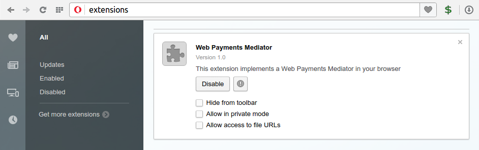

# Web Payments Demo
The code in this repository implements a demo of the proposed [Web Payments](https://www.w3.org/Payments/WG/) system. In the different subfolders you will find:
* A chrome browser extension which implements payment mediation. This extension works for Opera, Chrome and possibly other Chromium-based browsers.
* A simple [payment app](https://tommythorsen.github.io/webpayments-demo/payment-apps/tommypay/).
* A [demo webshop](https://tommythorsen.github.io/webpayments-demo/merchants/clothing/) which allows you to "purchase" items with web payments.

## Detailed Instructions
### 1. Installing the extension
The central component of this demo, is the extension which implements payment mediation in your browser. Since it is not uploaded to the Chrome Web Store, there are a few manual steps necessary to install it.

1. Download the extension by [clicking here](https://tommythorsen.github.io/webpayments-demo/files/mediator-extension.crx).
2. Open the extensions pane by entering `chrome://extensions` in the address field.
3. Drag the extension file (mediator-extension.crx) you downloaded earlier from a file browser window and drop it onto the extensions pane. Your extension pane should now look something like this:

*Screenshot is from the Opera browser*

Note the new **$** icon next to the address bar. Clicking on this icon will display the list of installed payment apps. It is currently empty, so let's go to step 2 and install a payment app.

### 2. Installing a payment app
1. Navigate to the [payment app](https://tommythorsen.github.io/webpayments-demo/payment-apps/tommypay/) web page.
2. Click on the "install Payment App" button.
3. You should see an alert dialog telling you that the TommyPay payment app was installed.
4. Click on the **$** icon next to the address bar to verify that the payment app is now available for payments.

### 3. Buy something with Web Payments
Don't worry, you don't have to spend any real money to try this.

1. Navigate to the [demo webshop](https://tommythorsen.github.io/webpayments-demo/merchants/clothing/).
2. Click the "Buy" button for an item that you would like to buy.
3. TBD
