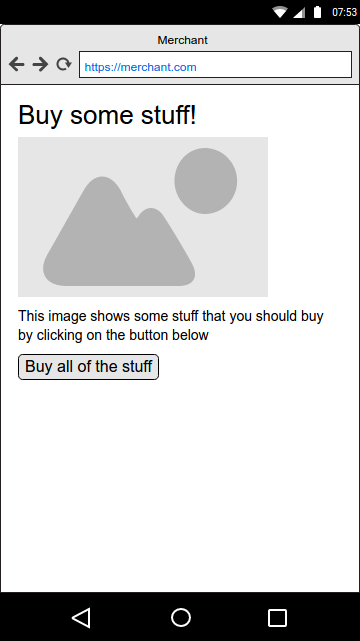

# Recommended Payment Apps

The following is an example of a user flow, using [merchant recommended payment apps](https://w3c.github.io/webpayments-payment-apps-api/#summary-recommended-apps). As this is a subject that is not yet specified with a lot of detail, this example can also serve as a proposal.

In this example, we have a merchant who only supports a single payment method -- TommyPay. The user/customer has never used Web Payments before, and does not have any installed payment apps. Since the merchant does not support basic card payments, there intersection between supported payment methods for the merchant and for the user will be empty.

Let's start with the user perusing the merchant's web site:



Being in dire need of more stuff, the user clicks the "buy" button, triggering the following javascript code:

```javascript
var methodData = [
    {
        supportedMethods: [ "https://tommypay.no/pay" ],
        data: {
            tommypaytoken: "1234123412347"
        }
    }
]
var details = {
    total: {
        label: "Total",
        amount: { currency: "USD", value: "100.00" }
    },
    displayItems: [
        {
            label: "So much stuff",
            amount: { currency: "USD", value: "100.00" }
        }
    ],
}

var request = new PaymentRequest(methodData, details);
request.show()
```

To be continued...
