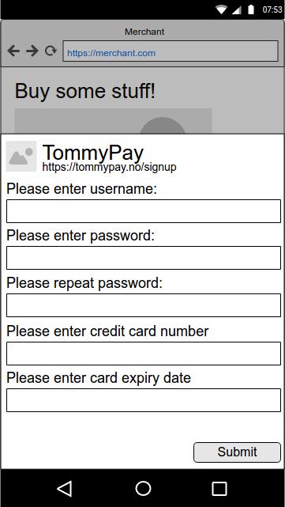
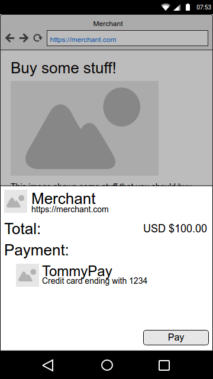
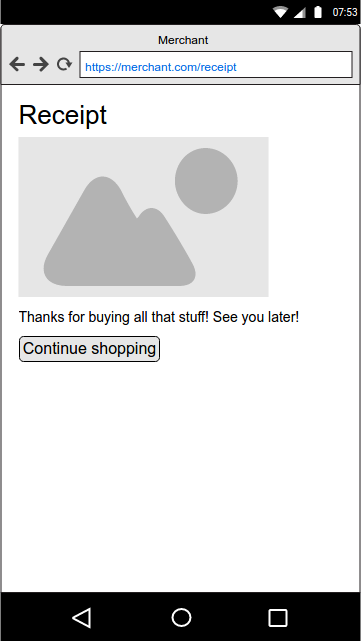

# Recommended Payment Apps

The following is an example of a user flow, using [merchant recommended payment apps](https://w3c.github.io/webpayments-payment-apps-api/#summary-recommended-apps). As this is a subject that is not yet specified with a lot of detail, this example can also serve as a proposal.

In this example, we have a merchant who only supports a single payment method -- TommyPay. The user/customer has never used Web Payments before, and does not have any installed payment apps.


## 1. Shopping

Let's start with the user perusing the merchant's web site:


Being in dire need of more stuff, the user clicks the "Buy all of the stuff" button, triggering the following javascript code:

```javascript
var methodData = [
    {
        supportedMethods: [ "https://tommypay.no/pay" ],
        data: {
            tommypaytoken: "1234123412347"
        }
    }
]
var details = {
    total: {
        label: "Total",
        amount: { currency: "USD", value: "100.00" }
    },
    displayItems: [
        {
            label: "So much stuff",
            amount: { currency: "USD", value: "100.00" }
        }
    ],
    recommendedPaymentApps: [
        "https://tommypay.no/signup"
    ]
}

var request = new PaymentRequest(methodData, details);
request.show()
```


## 2. What we don't want

Since the merchant does not support basic card payments, and the user has no payment apps installed, the intersection between supported payment methods for the merchant and for the user will be empty. This will probably be a fairly common case, especially in the early days of Web Payments, and we absolutely does not want to put the user in a dead end, like this:


## 3. A much better experience

Instead, we should give the user an opportunity to install a payment app and continue the payment. This is important for two reasons:

1. The customer gets to buy his stuff, which makes the customer, the merchant and the payment provider happy.
2. We get to bootstrap the web payments feature and the payment app ecosystem.

If the browser is able to show one or more payment apps that are recommended by the merchant, the user experience could look something like this:


The UI element for the recommended payment app consists of an icon, a label and the url which was provided in the payment request above. Earlier proposals have allowed the merchant to provide the remaining information (icon and label), but based on recent discussions (for instance in [issue #48](https://github.com/w3c/webpayments-payment-apps-api/issues/48)), I propose that the merchant only provides a url that points to a web page which is capable of installing a recommended payment app. The icon and label should be fetched from the resource pointed to by this url. This can be done by means of [Link Headers](https://www.w3.org/wiki/LinkHeader), or by downloading and parsing the whole web page, looking through the html for the information we need. If using link headers, it might be possible to get the icon and label directly, or it is possible to go through an intermediate step in the form of a manifest file.


## 4. Installing the payment app

If the user would like to continue the payment by installing TommyPay, and clicks the TommyPay element in the screen above, we load the web page https://tommypay.no/signup inside the payment request dialog. This might look something like:



After the user fills in all the required information in the TommyPay registration form, and presses "Submit", a service worker will be installed to handle the https://tommypay.no/pay payment method.

```javascript
navigator.serviceWorker.register("./app.js")
.then(function(registration) {
    return registration.paymentAppManager.setManifest({
        name: "TommyPay",
        icons: [
            {
                src: "icon.png",
                sizes: "48x48",
            } ],
        options: [
            {
                id: "card-1234",
                name: "Credit card ending with 1234",
                icons: [
                    {
                        src: "card.png",
                        sizes: "48x48",
                    } ],
                enabledMethods: [ "https://tommypay.no/pay" ]
            } ]
    });
}).then(function() {
    console.log("successfully registered");
    window.close();
}).catch(function(error) {
    console.log("registration error: " + error);
    window.close();
});
```


## Ready to pay some money

After installing the payment app, and closing the signup web page, we're back in the regular payment request dialog, but now we have an installed payment app that can handle the current payment request. All the user has to do now, is click the "Pay" button.



Clicking the "Pay" button causes a [PaymentAppRequest](https://w3c.github.io/webpayments-payment-apps-api/#sec-app-request) to be passed in a payment request event to the service worker we just registered above. In many cases, the payment app might choose to show some UI here, for instance, in order to verify the card's three-digit control code. However, for the sake of simplicity, let's assume it immediately responds with a [PaymentAppResponse](https://w3c.github.io/webpayments-payment-apps-api/#sec-app-response), which again is used to construct a `PaymentResponse` which is passed back to the merchant.


## Done!



The customer gets his stuff, the merchant gets his money, and so does presumably the payment provider. Everyone's happy :)
