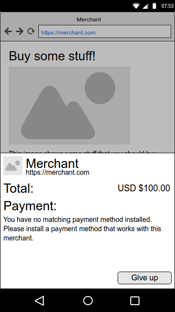

# Recommended Payment Apps

The following is an example of a user flow, using [merchant recommended payment apps](https://w3c.github.io/webpayments-payment-apps-api/#summary-recommended-apps). As this is a subject that is not yet specified with a lot of detail, this example can also serve as a proposal.

In this example, we have a merchant who only supports a single payment method -- TommyPay. The user/customer has never used Web Payments before, and does not have any installed payment apps.


## 1. Shopping

Let's start with the user perusing the merchant's web site:


Being in dire need of more stuff, the user clicks the "buy" button, triggering the following javascript code:

```javascript
var methodData = [
    {
        supportedMethods: [ "https://tommypay.no/pay" ],
        data: {
            tommypaytoken: "1234123412347"
        }
    }
]
var details = {
    total: {
        label: "Total",
        amount: { currency: "USD", value: "100.00" }
    },
    displayItems: [
        {
            label: "So much stuff",
            amount: { currency: "USD", value: "100.00" }
        }
    ],
    recommendedPaymentApps: [
        "https://tommypay.no/signup"
    ]
}

var request = new PaymentRequest(methodData, details);
request.show()
```


## 2. What we don't want

Since the merchant does not support basic card payments, and the user has no payment apps installed, the intersection between supported payment methods for the merchant and for the user will be empty. This will probably be a fairly common case, especially in the early days of Web Payments, and we absolutely does not want to put the user in a dead end, like this:




## 3. A much better experience

Instead, we should give the user an opportunity to install a payment app and continue the payment. This is important for two reasons:

1. The customer gets to buy his stuff, which makes the customer, the merchant and the payment provider happy.
2. We get to bootstrap the web payments feature and the payment app ecosystem.

If the browser is able to show one or more payment apps that are recommended by the merchant, the user experience could look something like this:


